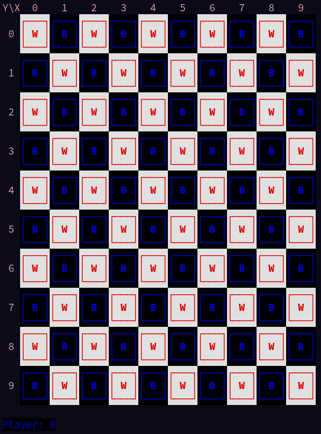
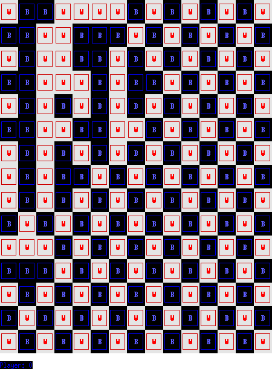
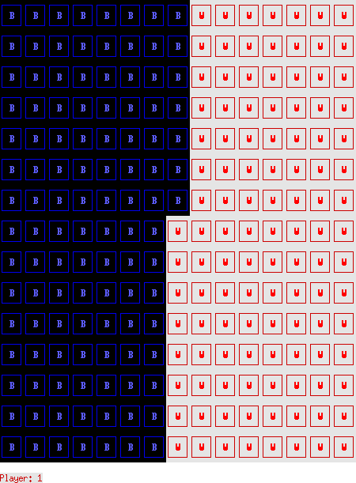

# PLOG TP1 RI - T3 Emulsion\_1

## Identificação dos elementos do grupo

- João de Jesus Costa - up201806560
- João Lucas Silva Martins - up201806436

## Descrição do jogo

[Sítio onde obtemos esta informação.](https://boardgamegeek.com/boardgame/311851/emulsion)

Emulsion é um jogo de tabuleiro para dois jogadores.  
O tabuleiro está organizado em quadrículas (**peças**) de duas cores distintas
(originalmente preto e branco). Este tabuleiro tem tamanho NxN, sendo que N é
um qualquer número inteiro. No ínicio do jogo, as **peças** estão organizadas
em xadrez.

- O **valor** de uma peça é o número de peças ortogonalmente adjacentes a essa
  mais metade do número de limites do tabuleiro adjacentes.

- O **grupo** de uma peça é o conjunto de todas as peças a que podemos chegar
  através de movimentos ortogonais entre peças adjacentes.

- O **tamanho de um grupo** é o número de peças nele.

- A **pontuação de um jogador** é o tamanho do seu maior grupo.

O jogador com as **peças pretas** joga primeiro. Após cada jogada, passámos ao
turno do outro jogador.  
Durante o seu turno, um jogador pode trocar a posição de um par de peças de
cores diferentes ortogonal ou diagonalmente adjacentes de modo a aumentar
o **valor** da **peça** da sua cor nesse par.

O jogo termina quando já não existem mais jogadas disponíveis. O vencedor
é o jogador com mais **pontuação**.  
Em caso de empate, somamos sucessivamente às pontuações o valor do segundo,
terceiro, e por aí em diante maiores grupos de cada jogador até o empate
ser resolvido.  
Em tabuleiros com tamanho par (N par), é possível que haja um empate mesmo
depois da soma dos menores grupos. Nestes casos, o jogador que fez a última
jogada sai vitorioso.

## Repesentação interna do estado do jogo

O tabuleiro é representado internamente como uma lista de listas (NxN). Cada
uma das listas internas representa uma linha do tabuleiro. As peças são
representadas pelos números **0 e 1**, sendo 0 as peças pretas e 1 as peças
brancas.

O jogador atual é também representado pelos números **0 e 1**, com o mesmo
significado que as peças com o mesmo número.

### Escolha da jogada

O jogador insere as coordenadas da peça que quer trocar (Xe Y
pertencentes a [0, N[) e um direçao identificada pelas letras:
n, nw, w, sw, s, se, e, ne.

## Imagens

Initial board state:

```pl
  GameState = [
    [1, 0, 1, 0, 1, 0, 1, 0, 1, 0, 1, 0, 1, 0, 1],
    [0, 1, 0, 1, 0, 1, 0, 1, 0, 1, 0, 1, 0, 1, 0],
    [1, 0, 1, 0, 1, 0, 1, 0, 1, 0, 1, 0, 1, 0, 1],
    [0, 1, 0, 1, 0, 1, 0, 1, 0, 1, 0, 1, 0, 1, 0],
    [1, 0, 1, 0, 1, 0, 1, 0, 1, 0, 1, 0, 1, 0, 1],
    [0, 1, 0, 1, 0, 1, 0, 1, 0, 1, 0, 1, 0, 1, 0],
    [1, 0, 1, 0, 1, 0, 1, 0, 1, 0, 1, 0, 1, 0, 1],
    [0, 1, 0, 1, 0, 1, 0, 1, 0, 1, 0, 1, 0, 1, 0],
    [1, 0, 1, 0, 1, 0, 1, 0, 1, 0, 1, 0, 1, 0, 1],
    [0, 1, 0, 1, 0, 1, 0, 1, 0, 1, 0, 1, 0, 1, 0],
    [1, 0, 1, 0, 1, 0, 1, 0, 1, 0, 1, 0, 1, 0, 1],
    [0, 1, 0, 1, 0, 1, 0, 1, 0, 1, 0, 1, 0, 1, 0],
    [1, 0, 1, 0, 1, 0, 1, 0, 1, 0, 1, 0, 1, 0, 1],
    [0, 1, 0, 1, 0, 1, 0, 1, 0, 1, 0, 1, 0, 1, 0],
    [1, 0, 1, 0, 1, 0, 1, 0, 1, 0, 1, 0, 1, 0, 1]
  ].
```



Mid game board state:

```pl
  GameState = [
    [1, 0, 0, 1, 1, 1, 1, 0, 1, 0, 1, 0, 1, 0, 1],
    [0, 0, 1, 1, 0, 0, 0, 1, 0, 1, 0, 1, 0, 1, 0],
    [1, 0, 1, 1, 0, 0, 1, 0, 1, 0, 1, 0, 1, 0, 1],
    [0, 0, 1, 1, 1, 0, 1, 0, 0, 1, 0, 1, 0, 1, 0],
    [1, 0, 1, 0, 1, 0, 1, 0, 1, 0, 1, 0, 1, 0, 1],
    [0, 0, 1, 1, 0, 0, 1, 1, 0, 1, 0, 1, 0, 1, 0],
    [1, 0, 1, 0, 1, 0, 1, 0, 1, 0, 1, 0, 1, 0, 1],
    [1, 0, 1, 0, 0, 1, 0, 1, 0, 1, 0, 1, 0, 1, 0],
    [1, 0, 1, 0, 1, 0, 1, 0, 1, 0, 1, 0, 1, 0, 1],
    [0, 1, 0, 1, 0, 1, 0, 1, 0, 1, 0, 1, 0, 1, 0],
    [1, 1, 1, 0, 1, 0, 1, 0, 1, 0, 1, 0, 1, 0, 1],
    [0, 0, 0, 1, 0, 1, 0, 1, 0, 1, 0, 1, 0, 1, 0],
    [1, 0, 1, 0, 1, 0, 1, 0, 1, 0, 1, 0, 1, 0, 1],
    [0, 1, 0, 1, 0, 1, 0, 1, 0, 1, 0, 1, 0, 1, 0],
    [1, 0, 1, 0, 1, 0, 1, 0, 1, 0, 1, 0, 1, 0, 1]
  ].
```



End board state:

```pl
  GameState = [
    [0, 0, 0, 0, 0, 0, 0, 0, 1, 1, 1, 1, 1, 1, 1],
    [0, 0, 0, 0, 0, 0, 0, 0, 1, 1, 1, 1, 1, 1, 1],
    [0, 0, 0, 0, 0, 0, 0, 0, 1, 1, 1, 1, 1, 1, 1],
    [0, 0, 0, 0, 0, 0, 0, 0, 1, 1, 1, 1, 1, 1, 1],
    [0, 0, 0, 0, 0, 0, 0, 0, 1, 1, 1, 1, 1, 1, 1],
    [0, 0, 0, 0, 0, 0, 0, 0, 1, 1, 1, 1, 1, 1, 1],
    [0, 0, 0, 0, 0, 0, 0, 0, 1, 1, 1, 1, 1, 1, 1],
    [0, 0, 0, 0, 0, 0, 0, 1, 1, 1, 1, 1, 1, 1, 1],
    [0, 0, 0, 0, 0, 0, 0, 1, 1, 1, 1, 1, 1, 1, 1],
    [0, 0, 0, 0, 0, 0, 0, 1, 1, 1, 1, 1, 1, 1, 1],
    [0, 0, 0, 0, 0, 0, 0, 1, 1, 1, 1, 1, 1, 1, 1],
    [0, 0, 0, 0, 0, 0, 0, 1, 1, 1, 1, 1, 1, 1, 1],
    [0, 0, 0, 0, 0, 0, 0, 1, 1, 1, 1, 1, 1, 1, 1],
    [0, 0, 0, 0, 0, 0, 0, 1, 1, 1, 1, 1, 1, 1, 1],
    [0, 0, 0, 0, 0, 0, 0, 1, 1, 1, 1, 1, 1, 1, 1]
  ].
```


